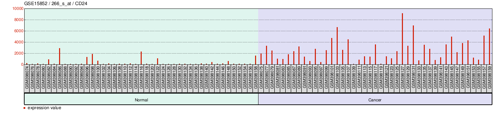
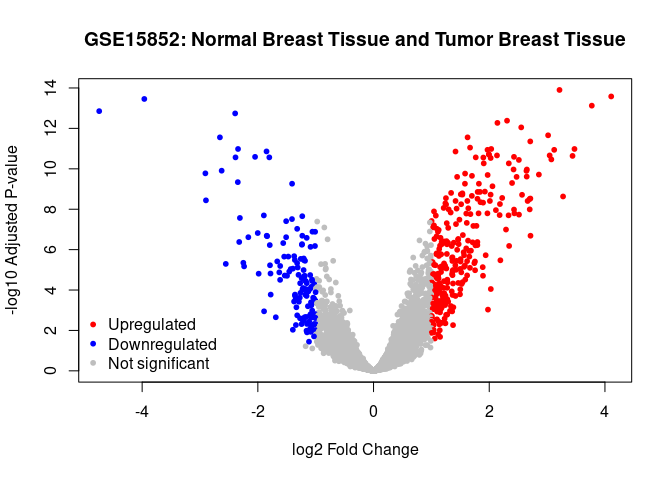

Final RMarkdown
================
Sophia Wheelton
2025-11-18

- [ABSTRACT](#abstract)
- [BACKGROUND](#background)
- [STUDY QUESTION AND HYPOTHESIS](#study-question-and-hypothesis)
  - [QUESTIONS](#questions)
  - [HYPOTHESIS](#hypothesis)
  - [PREDICTION](#prediction)
- [METHODS](#methods)
  - [FIRST ANALYSIS AND PLOT](#first-analysis-and-plot)
  - [Second ANALYSIS AND PLOT](#second-analysis-and-plot)
- [DISCUSSION](#discussion)
  - [INTERPRETATION OF FIRST
    ANALYSIS](#interpretation-of-first-analysis)
  - [INTERPRETATION OF SECOND
    ANALYSIS](#interpretation-of-second-analysis)
- [CONCLUSION](#conclusion)
- [REFERENCES](#references)

# ABSTRACT

CD24 is a surface marker present on cancer stem cells. Research into the
relationship between CD24 and cancer will help build our understanding
of the genetic basis of breast cancer. This knowledge will help in the
improvement of current treatments, the development of new treatments,
and will provide insight into the making of certain preventative
measures. Bong et al., found that there was an positive relationship
between the gene expression of CD24 and breast cancer. This means that
increased CD24 expression was present in tumor breast tissue when
compared to normal breast tissue. This might be evidence of a causal
relationship, though additional research is needed to confirm that. Bong
et al., also found that there were dozens of genes that had
statistically different expression levels between tumor and normal
breast tissue. This complicates the suggested causal role as breast
cancer may be caused by a combination of different genes instead of just
one.

# BACKGROUND

In the United States, around 1 in 8 women will be diagnosed with
invasive breast cancer in her lifetime. While men account for less than
1% of all breast cancer cases, when compared to women, men are more
likely to be diagnosed with advanced breast cancer (American Cancer
Society, 2024). Increased understanding of the genetic components of
breast cancer is necessary if there is any hope of decreasing the
prevalence of this disease.

Cancer stem cells are tumor cells that undergo self-renewal and
differentiation (Jaggupilli and Elkord, 2012). Past research has linked
these cancer stem cells to the initiation and maintenance of a tumor.
The CD24 surface marker is anchored by glycosyl-phosphotidyl-inositol
and is heavily glycosylated in a variety of cancer cells (Jaggupilli and
Elkord, 2012). Differences in glycosylation level result in different
functions in different cells. The CD24 surface marker is present on
cancer stem cells, and is thus used to identify and isolate these cancer
stem cells. Previous research has shown that CD24 is highly expressed in
several different types of cancers.

Further research investigating the expression of genes related to the
CD24 surface marker (called the CD24 gene in this report) will help us
better understand the causal or correlative role this gene plays in
breast cancer. It is still not known whether CD24 is working in
combination with other surface markers or how specific the CD24 surface
markers are to certain types of cancer (Jaggupilli and Elkord, 2012).
Analyzing gene expression of CD24 and other genes in cancerous and
normal tissue will help clarify some of these questions.

# STUDY QUESTION AND HYPOTHESIS

## QUESTIONS

How much does gene expression of CD24 differ between human cancer breast
tissue and normal human breast tissue?

## HYPOTHESIS

The expression of CD24 will differ significantly between tumor breast
tissue and normal breast tissue.

## PREDICTION

We predict that the expression of CD24 will be increased in tumor breast
tissue.

# METHODS

Bong et al. collected total RNAs from individuals with breast cancer and
normal tissues. The sample population consisted of women from Malaysia,
China, and India. The age range was 22 to 79 years old.

The total RNAs were processed and hybridized on an oligonucleotide array
chip (specifically the Affymetrix genechip U133A) for 16 hours. There
was a total of 86 sets of gene expression data. Of these 86 sets, 43
were from individuals with breast tumors and 43 were from individuals
with normal breast tissue. The differences in gene expression between
the tumor and normal groups was compared using paired t-tests (Bong et
al., 2010). The Bonferroni multiple test correction was used to adjust
the P-values for the false discovery rate.

A significant issue present in this study and many other genetic studies
is the false discovery rate. In studies where hundreds of relationships
are being analyzed for a definitive relationship, the chance of getting
a false-positive is high. A false-positive is when there is no
relationship in the general population, but there happens to be a
relationship in the sample population, which is then interpreted as a
positive relationship for everyone. This can be accounted for using
several different methods - the one used in this study is the Bonferroni
multiple test correction method. This adjusts the P-value to one that is
more accurate.

The data was processed and analyzed using the GEO2R software. Geo2R uses
a variety of R packages - including DESeq2, GEOquery, and limma (Linear
Models for Microarray Analysis) - to perform differential expression
analysis using series matrix data. We downloaded these packages and
libraries into R, so that we could call up certain groups or variables.

## FIRST ANALYSIS AND PLOT

We first analyzed the role of CD24 gene expression in breast cancer
tissue. To analyze the data using the GEO2R software, we entered the
series accession number (GSE15852) and defined our sample groups. We
split the sample population into individuals with normal breast tissue
and then into those with tumor breast tissue. Once those groups were
defined, we applied the Bonferroni adjustment method for the P-values
and analyzed the data with the Geo2R software. After selecting the CD24
gene, we were able to compare the gene expression level of the CD24 gene
in sample individuals with tumor breast tissue to those with normal
breast tissue. This visualization shows the gene expression level of
each individual in the sample data set separated into the tumor and
normal breast tissue groups. As there was no way to code the graph
directly, the following code installs the packages, defines some
important variables, and then calls up the image previously provided.

``` r
# Version info: R 4.2.2, Biobase 2.58.0, GEOquery 2.66.0, limma 3.54.0
################################################################
#   Data plots for selected GEO samples
if (!require("BiocManager", quietly = TRUE))
  install.packages("BiocManager")
```

    ## Bioconductor version '3.18' is out-of-date; the current release version '3.22'
    ##   is available with R version '4.5'; see https://bioconductor.org/install

``` r
BiocManager::install("GEOquery")
```

    ## 'getOption("repos")' replaces Bioconductor standard repositories, see
    ## 'help("repositories", package = "BiocManager")' for details.
    ## Replacement repositories:
    ##     CRAN: http://rspm/default/__linux__/focal/latest

    ## Bioconductor version 3.18 (BiocManager 1.30.26), R 4.3.3 (2024-02-29)

    ## Warning: package(s) not installed when version(s) same as or greater than current; use
    ##   `force = TRUE` to re-install: 'GEOquery'

    ## Installation paths not writeable, unable to update packages
    ##   path: /opt/R/4.3.3/lib/R/library
    ##   packages:
    ##     boot, class, cluster, codetools, foreign, KernSmooth, lattice, nlme, nnet,
    ##     rpart, spatial, survival

    ## Old packages: 'digest'

``` r
library(GEOquery)
```

    ## Loading required package: Biobase

    ## Loading required package: BiocGenerics

    ## 
    ## Attaching package: 'BiocGenerics'

    ## The following objects are masked from 'package:stats':
    ## 
    ##     IQR, mad, sd, var, xtabs

    ## The following objects are masked from 'package:base':
    ## 
    ##     anyDuplicated, aperm, append, as.data.frame, basename, cbind,
    ##     colnames, dirname, do.call, duplicated, eval, evalq, Filter, Find,
    ##     get, grep, grepl, intersect, is.unsorted, lapply, Map, mapply,
    ##     match, mget, order, paste, pmax, pmax.int, pmin, pmin.int,
    ##     Position, rank, rbind, Reduce, rownames, sapply, setdiff, sort,
    ##     table, tapply, union, unique, unsplit, which.max, which.min

    ## Welcome to Bioconductor
    ## 
    ##     Vignettes contain introductory material; view with
    ##     'browseVignettes()'. To cite Bioconductor, see
    ##     'citation("Biobase")', and for packages 'citation("pkgname")'.

    ## Setting options('download.file.method.GEOquery'='auto')

    ## Setting options('GEOquery.inmemory.gpl'=FALSE)

``` r
if (!require("BiocManager", quietly = TRUE))
  install.packages("BiocManager")

BiocManager::install("limma")
```

    ## 'getOption("repos")' replaces Bioconductor standard repositories, see
    ## 'help("repositories", package = "BiocManager")' for details.
    ## Replacement repositories:
    ##     CRAN: http://rspm/default/__linux__/focal/latest

    ## Bioconductor version 3.18 (BiocManager 1.30.26), R 4.3.3 (2024-02-29)

    ## Warning: package(s) not installed when version(s) same as or greater than current; use
    ##   `force = TRUE` to re-install: 'limma'

    ## Installation paths not writeable, unable to update packages
    ##   path: /opt/R/4.3.3/lib/R/library
    ##   packages:
    ##     boot, class, cluster, codetools, foreign, KernSmooth, lattice, nlme, nnet,
    ##     rpart, spatial, survival

    ## Old packages: 'digest'

``` r
library(limma)
```

    ## 
    ## Attaching package: 'limma'

    ## The following object is masked from 'package:BiocGenerics':
    ## 
    ##     plotMA

``` r
install.packages("umap")
```

    ## Installing package into '/cloud/lib/x86_64-pc-linux-gnu-library/4.3'
    ## (as 'lib' is unspecified)

``` r
library(umap)

# Version info: R 4.2.2, Biobase 2.58.0, GEOquery 2.66.0, limma 3.54.0
################################################################
#   Differential expression analysis with limma
library(GEOquery)
library(limma)
library(umap)

# load series and platform data from GEO

gset <- getGEO("GSE15852", GSEMatrix =TRUE, AnnotGPL=TRUE)
```

    ## Found 1 file(s)

    ## GSE15852_series_matrix.txt.gz

``` r
if (length(gset) > 1) idx <- grep("GPL96", attr(gset, "names")) else idx <- 1
gset <- gset[[idx]]

# make proper column names to match toptable 
fvarLabels(gset) <- make.names(fvarLabels(gset))

# group membership for all samples
gsms <- paste0("01010101010101010101010101010101010101010101010101",
               "010101010101010101010101010101010101")
sml <- strsplit(gsms, split="")[[1]]

# log2 transformation
ex <- exprs(gset)
qx <- as.numeric(quantile(ex, c(0., 0.25, 0.5, 0.75, 0.99, 1.0), na.rm=T))
LogC <- (qx[5] > 100) ||
  (qx[6]-qx[1] > 50 && qx[2] > 0)
if (LogC) { ex[which(ex <= 0)] <- NaN
exprs(gset) <- log2(ex) }

# assign samples to groups and set up design matrix
gs <- factor(sml)
groups <- make.names(c("Normal Breast Tissue","Tumor Breast Tissue"))
levels(gs) <- groups
gset$group <- gs
design <- model.matrix(~group + 0, gset)
colnames(design) <- levels(gs)

gset <- gset[complete.cases(exprs(gset)), ] # skip missing values

fit <- lmFit(gset, design)  # fit linear model

# set up contrasts of interest and recalculate model coefficients
cts <- paste(groups[1], groups[2], sep="-")
cont.matrix <- makeContrasts(contrasts=cts, levels=design)
fit2 <- contrasts.fit(fit, cont.matrix)

# compute statistics and table of top significant genes
fit2 <- eBayes(fit2, 0.01)
tT <- topTable(fit2, adjust="fdr", sort.by="B", number=250)

tT <- subset(tT, select=c("ID","adj.P.Val","P.Value","t","B","logFC","Gene.symbol","Gene.title","Gene.ID"))

# Visualize and quality control test results.
# Build histogram of P-values for all genes. Normal test
# assumption is that most genes are not differentially expressed.
tT2 <- topTable(fit2, adjust="fdr", sort.by="B", number=Inf)

# summarize test results as "up", "down" or "not expressed"
dT <- decideTests(fit2, adjust.method="fdr", p.value=0.05, lfc=0)

#Expression Levels

```


This plot shows that the CD24 gene was expressed more in those with
tumor breast tissue compared to those with normal breast tissue.
However, the exact expression level varied significantly in those with
tumor breast tissue.

## Second ANALYSIS AND PLOT

After analyzing the role gene expression of CD24 plays in tumor breast
tissue, we investigated other possible genes that differ between the
normal and tumor breast tissue groups. Specifically, we determined if
the genes were upregulated or downregulated in tumor breast tissue. This
was also performed using the Geo2R analysis with the same defined groups
(normal vs tumor breast tissue) and the Bonferrini P-value adjustment.
Regarding the code, the data was called up from the Geoquery library and
certain variables were defined prior to the making of the visualization.
The resulting visualization was of a volcano plot with the genes
significantly involved in tumor breast tissue being highlighted.
Additional code was included to make the visualization easier to read
and understand.

``` r
# Version info: R 4.2.2, Biobase 2.58.0, GEOquery 2.66.0, limma 3.54.0
################################################################
#   Data plots for selected GEO samples
if (!require("BiocManager", quietly = TRUE))
  install.packages("BiocManager")

BiocManager::install("GEOquery")
```

    ## 'getOption("repos")' replaces Bioconductor standard repositories, see
    ## 'help("repositories", package = "BiocManager")' for details.
    ## Replacement repositories:
    ##     CRAN: http://rspm/default/__linux__/focal/latest

    ## Bioconductor version 3.18 (BiocManager 1.30.26), R 4.3.3 (2024-02-29)

    ## Warning: package(s) not installed when version(s) same as or greater than current; use
    ##   `force = TRUE` to re-install: 'GEOquery'

    ## Installation paths not writeable, unable to update packages
    ##   path: /opt/R/4.3.3/lib/R/library
    ##   packages:
    ##     boot, class, cluster, codetools, foreign, KernSmooth, lattice, nlme, nnet,
    ##     rpart, spatial, survival

    ## Old packages: 'digest'

``` r
library(GEOquery)
if (!require("BiocManager", quietly = TRUE))
  install.packages("BiocManager")

BiocManager::install("limma")
```

    ## 'getOption("repos")' replaces Bioconductor standard repositories, see
    ## 'help("repositories", package = "BiocManager")' for details.
    ## Replacement repositories:
    ##     CRAN: http://rspm/default/__linux__/focal/latest

    ## Bioconductor version 3.18 (BiocManager 1.30.26), R 4.3.3 (2024-02-29)

    ## Warning: package(s) not installed when version(s) same as or greater than current; use
    ##   `force = TRUE` to re-install: 'limma'

    ## Installation paths not writeable, unable to update packages
    ##   path: /opt/R/4.3.3/lib/R/library
    ##   packages:
    ##     boot, class, cluster, codetools, foreign, KernSmooth, lattice, nlme, nnet,
    ##     rpart, spatial, survival

    ## Old packages: 'digest'

``` r
library(limma)
install.packages("umap")
```

    ## Installing package into '/cloud/lib/x86_64-pc-linux-gnu-library/4.3'
    ## (as 'lib' is unspecified)

``` r
library(umap)

# Version info: R 4.2.2, Biobase 2.58.0, GEOquery 2.66.0, limma 3.54.0
################################################################
#   Differential expression analysis with limma
library(GEOquery)
library(limma)
library(umap)

# load series and platform data from GEO

gset <- getGEO("GSE15852", GSEMatrix =TRUE, AnnotGPL=TRUE)
```

    ## Found 1 file(s)

    ## GSE15852_series_matrix.txt.gz

    ## Using locally cached version: /tmp/Rtmp7VZ4mM/GSE15852_series_matrix.txt.gz

    ## Using locally cached version of GPL96 found here:
    ## /tmp/Rtmp7VZ4mM/GPL96.annot.gz

``` r
if (length(gset) > 1) idx <- grep("GPL96", attr(gset, "names")) else idx <- 1
gset <- gset[[idx]]

# make proper column names to match toptable 
fvarLabels(gset) <- make.names(fvarLabels(gset))

# group membership for all samples
gsms <- paste0("01010101010101010101010101010101010101010101010101",
               "010101010101010101010101010101010101")
sml <- strsplit(gsms, split="")[[1]]

# log2 transformation
ex <- exprs(gset)
qx <- as.numeric(quantile(ex, c(0., 0.25, 0.5, 0.75, 0.99, 1.0), na.rm=T))
LogC <- (qx[5] > 100) ||
  (qx[6]-qx[1] > 50 && qx[2] > 0)
if (LogC) { ex[which(ex <= 0)] <- NaN
exprs(gset) <- log2(ex) }

# assign samples to groups and set up design matrix
gs <- factor(sml)
groups <- make.names(c("Normal Breast Tissue","Tumor Breast Tissue"))
levels(gs) <- groups
gset$group <- gs
design <- model.matrix(~group + 0, gset)
colnames(design) <- levels(gs)

gset <- gset[complete.cases(exprs(gset)), ] # skip missing values

fit <- lmFit(gset, design)  # fit linear model

# set up contrasts of interest and recalculate model coefficients
cts <- paste(groups[1], groups[2], sep="-")
cont.matrix <- makeContrasts(contrasts=cts, levels=design)
fit2 <- contrasts.fit(fit, cont.matrix)

# compute statistics and table of top significant genes
fit2 <- eBayes(fit2, 0.01)
tT <- topTable(fit2, adjust="fdr", sort.by="B", number=250)

tT <- subset(tT, select=c("ID","adj.P.Val","P.Value","t","B","logFC","Gene.symbol","Gene.title","Gene.ID"))

# Visualize and quality control test results.
# Build histogram of P-values for all genes. Normal test
# assumption is that most genes are not differentially expressed.
tT2 <- topTable(fit2, adjust="fdr", sort.by="B", number=Inf)

# summarize test results as "up", "down" or "not expressed"
dT <- decideTests(fit2, adjust.method="fdr", p.value=0.05, lfc=0)

# Volcano plot (log P-value vs log fold change)
colnames(fit2) # list contrast names
```

    ## [1] "Normal.Breast.Tissue-Tumor.Breast.Tissue"

``` r
ct <- 1  # choose contrast of interest
dT <- topTable(fit2, coef = ct, number = Inf, adjust.method = "BH")

# Define thresholds
logFC_cutoff <- 1
adjP_cutoff <- 0.05

# Assign colors based on thresholds
dT$color <- "grey"  # default
dT$color[dT$logFC >  logFC_cutoff & dT$adj.P.Val < adjP_cutoff] <- "red"    # upregulated
dT$color[dT$logFC < -logFC_cutoff & dT$adj.P.Val < adjP_cutoff] <- "blue"   # downregulated

# Clean up the contrast name (remove periods)
contrast_name <- gsub("\\.", " ", colnames(fit2)[ct])
contrast_name <- gsub("-", " and ", contrast_name)

# Draw volcano plot
with(dT, plot(logFC, -log10(adj.P.Val),
              pch = 20,
              col = color,
              main = paste("GSE15852:", contrast_name),
              xlab = "log2 Fold Change",
              ylab = "-log10 Adjusted P-value"))

# Add legend
legend("bottomleft",
       legend = c("Upregulated", "Downregulated", "Not significant"),
       col = c("red", "blue", "grey"),
       pch = 20,
       bty = "n")
```

<!-- -->

The plot shows that there are hundreds of genes that are regulated
differently in tumor breast tissue. Of these genes, many of them have a
significant difference in expression, indicating a definitive link of
the expression of many of these genes to breast cancer. These
significant genes are highlighted in red and blue.

# DISCUSSION

The expression of the CD24 gene is increased in individuals with tumor
breast tissue. This suggests a potential causal role in breast cancer.
However, the main limitation of this study is that we can only
definitively say there was a correlation between CD24 gene expression
and breast cancer. We do not know if increased CD24 gene expression
caused breast cancer, or if there was something else that caused both
increased CD24 expression and breast cancer independently. There could
be a confounding variable present. Thus, we can only state a
correlative-, not a causative-relationship.

Another limitation with the study is the sample population of the data
set was women from Malaysia, China, and India. This diversity is both
helpful and hurtful for determining relationships. It is helpful because
the presence of different races makes the findings of the study more
generalizable. However, for the data to be applicable to everyone, the
sample population needs to include more diversity. Another study
analyzing of the relationship between gene expression and breast cancer
in males is also necessary.

## INTERPRETATION OF FIRST ANALYSIS

Visually, the first plot shows us that there is a link between CD24
expression and tumor presence. Specifically, increased CD24 expression
is seen in tumor breast tissue. This confirms our prediction. It is
important to note that the gene expression level varied between
individuals in the tumor breast tissue group. Additional research could
be done to determine if these different expression levels are linked to
the progression of the disease (i.e. stage 4).

## INTERPRETATION OF SECOND ANALYSIS

The second plot showed that there are hundreds of genes that differ in
expression between individuals in the normal breast tissue and the tumor
breast tissue groups. Dozens of these differ significantly. Analysis of
this plot produces a few important issues. The first is the issue of the
false discovery rate. The second issue is we do not understand exactly
how the genes relate to each other. Different combinations of different
genes might be the causal (technically correlative) factor in breast
cancer. Additional research needs to be done to analyze these
relationships. This will then help us determine if the individual genes
themselves are the causative factor, or if a group of the genes are
necessary for cancer to develop. It is a limitation of this study that
these gene relationships were not analyzed.

# CONCLUSION

We found a statistically significant relationship between CD24 gene
expression levels in tumor breast tissue compared to normal breast
tissue. Expression of the CD24 gene was increased in tumor breast
tissue. This might suggest a causative relationship; however, additional
research must be done to confirm this relationship. Although the CD24
gene was significantly important, we found that there were dozens of
genes with a significant relationship. This might suggest that multiple
genes working together influence cancer development. Overall, the
knowledge that CD24 is positively related to breast cancer helps build
our understanding of the genetic basis of breast cancer. This increased
understanding will help in the development of new treatment methods and
preventative measures.

# REFERENCES

1.  Pau Ni IB, Zakaria Z, Muhammad R, Abdullah N et al. Gene expression
    patterns distinguish breast carcinomas from normal breast tissues:
    the Malaysian context. Pathol Res Pract 2010 Apr 15;206(4):223-8.
    PMID: 20097481
2.  Jaggupilli A, Elkord E. Significance of CD44 and CD24 as cancer stem
    cell markers: an enduring ambiguity. Clin Dev Immunol.
    2012;2012:708036. doi: 10.1155/2012/708036. Epub 2012 May 30. PMID:
    22693526; PMCID: PMC3369436.
3.  OpenAI. (2025). ChatGPT (GPT-5) \[Large language model\]. OpenAI.
    <https://chat.openai.com/>
4.  Kristiansen G., Winzer K. J., Mayordomo E., Bellach J., Schlüns K.,
    Denkert C., Dahl E., Pilarsky C., Altevogt P., Guski H., and Dietel
    M., CD24 expression is a new prognostic marker in breast cancer,
    Clinical Cancer Research. (2003) 9, no. 13, 4906–4913,
    2-s2.0-10744220419.
5.  Zheng J., Li Y., Yang J., Liu Q., Shi M., Zhang R., Shi H., Ren Q.,
    Ma J., Guo H., Tao Y., Xue Y., Jiang N., Yao L., and Liu W., NDRG2
    inhibits hepatocellular carcinoma adhesion, migration and invasion
    by regulating CD24 expression, BMC Cancer. (2011) 11, article 251,
    2-s2.0-79959239754, <https://doi.org/10.1186/1471-2407-11-251>.
6.  Breast cancer facts & figures 2024-2025. American Cancer Society.
    (2024).
    <https://www.cancer.org/content/dam/cancer-org/research/cancer-facts-and-statistics/breast-cancer-facts-and-figures/2024/breast-cancer-facts-and-figures-2024.pdf>
